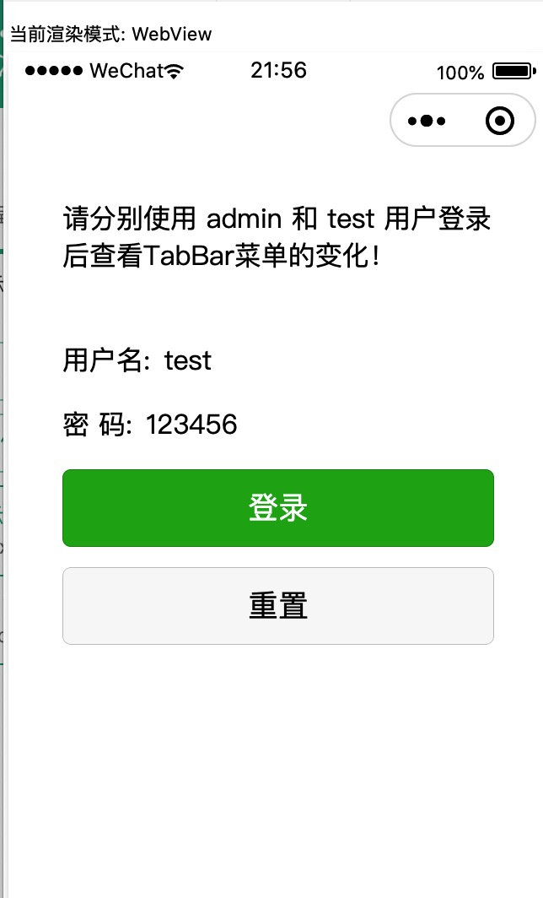
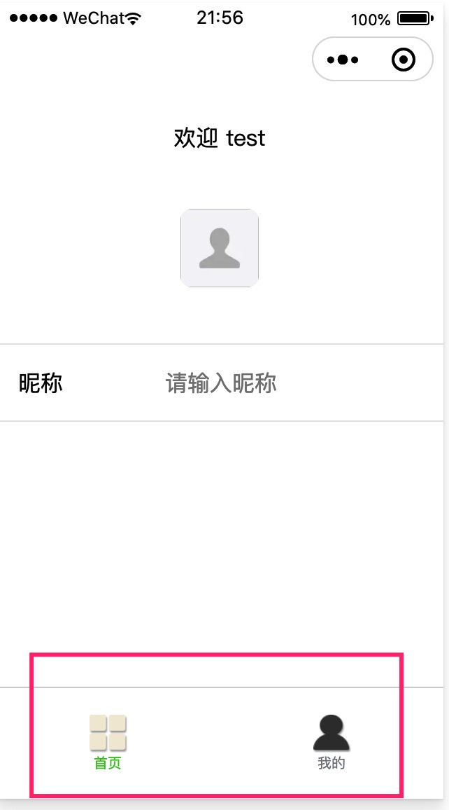
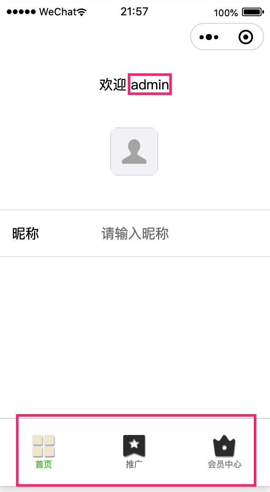
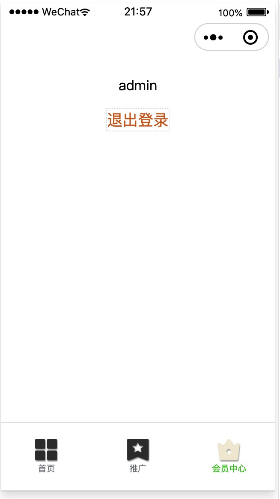

# 微信小程序 动态 tabBar 简单示例

小程序TabBar数据由远程API提供， 可实现完全动态根据不同用户显示不同的菜单， 
同时增加了getTabBarIndex 函数，可根据tabBar的pagePath 名称获取tab的索引，避免了索引和菜单不匹配的情况。

api数据示例： http://rap2api.taobao.org/app/mock/320908/loginTabDemo

## 动态显示tabBar技术要点：
1. 需要再app.json中的tabBar节点配置 "custom": true, 使用自定义tabBar;
   同时这个节点的 list里面就只需要指定tabBar的页面路径pagePath即可。

2. 在项目根目录创建 custom-tab-bar 目录，这个目录里面就是自定义tabBar的组件；
    注意这个目录只能是 custom-tab-bar 不能是其他的。

3. 在用户登录后根据用户的角色或者其他规则将用户对应的tabBar数据存储到本地存储里面， 
    然后却换 switchTab到tabBar的页面；
    当然，如果你的需求仅是动态获取tabBar或者小程序启动后就需要自动登录的话，可以将网络请求的逻辑写在app.js文件中， 既 onLaunch() {} 这个生命周期函数里面，这样的话就可以直接使用app.js里面的全局变量来保存tabBar数据，然后custom-tab-bar里面直接调用app.js中的全局变量数据tabBarList即可。

4. tabBar页面在onShow生命周期函数里面重新获取tabBar并设置当前tabBar, 这样就会触发tabBar里面的attached生命周期函数中的重新赋值tabBar数据的逻辑，从而实现动态更新TabBar;

5. 注意在用户退出后必须wx.reLaunch重新加载页面，否则换个用户登录tabBar不会改变！

## 测试方法
下载安装微信开发者工具， 然后打开本项目，设置好你的小程序appid 即可查看和演示效果

## 效果截图
引导页面

test用户菜单
 

admin用户菜单
  

退出页面

